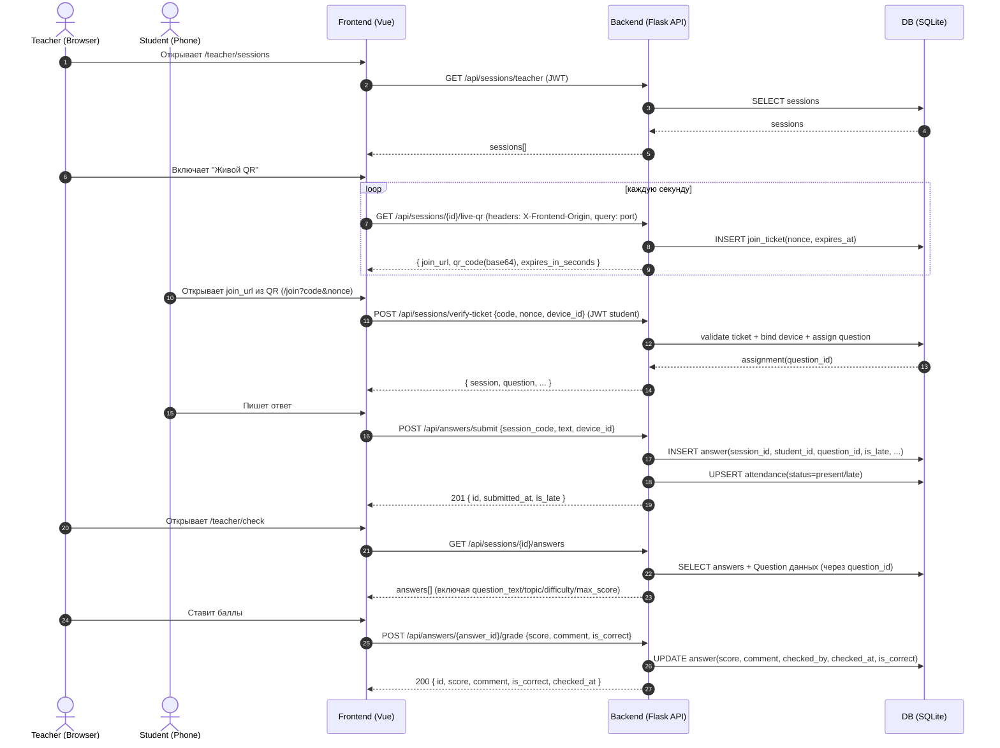

# ARCHITECTURE_PROJECT (C4 + API + QR/LAN)

Документ описывает архитектуру проекта **ClassQR** («Dynamic clustering system of educational results») в стиле C4, а также ключевые контракты API, обработку ошибок, кластеризацию и политику миграций.

## 1. Назначение системы

Система предназначена для проведения занятий/опросов (квизов) в учебной группе, выдачи вопросов студентам через **динамический QR**, приёма ответов, проверки/оценивания преподавателем и формирования аналитики по результатам (включая кластеризацию и динамику переходов).

Ключевые сценарии:
- преподаватель создаёт **сессию** занятия и включает «живой QR»;
- студент сканирует QR, получает **закреплённый** вопрос (в т.ч. из пула), отвечает **один раз**;
- преподаватель проверяет ответы, выставляет баллы и комментарий;
- рейтинг по группе (с приватностью/анонимностью);
- кластеризация студентов по качеству ответов и **история** распределений по кластерам.

## 2. Технологический стек

### Backend
- Python 3.10+
- Flask (REST API)
- Flask-SQLAlchemy (ORM)
- Flask-Cors (CORS/LAN)
- PyJWT (JWT auth)
- bcrypt (пароли)
- qrcode + Pillow (генерация QR)
- numpy (кластеризация k-means на NumPy)

### Frontend
- Vue 3
- Vue Router
- Pinia
- Axios
- Vite

### DevOps
- Docker / docker-compose (опционально)
- В dev: прокси `/api` с Vite на Flask

## 3. C4 — Уровень 1 (Контекст)

**Акторы**
- **Студент**: получает вопрос по QR, отправляет ответ, смотрит «Мои ответы», рейтинг.
- **Преподаватель**: создаёт сессии, показывает QR, проверяет ответы, запускает аналитику/кластеризацию.
- **Администратор**: управляет пользователями/группами/данными.

**Внешние зависимости**
- смартфоны/браузеры (сканирование QR);
- локальная сеть Wi‑Fi (LAN): телефон должен открыть **IP ноутбука**, не `localhost`.

## 4. C4 — Уровень 2 (Контейнеры)

### 4.1 Backend (Flask API)
- Слушает порт **5001** (dev) или 5000 (старые конфиги)
- Отдаёт REST API под `/api/*`
- Генерирует QR, проверяет токены, сохраняет данные в БД

### 4.2 Frontend (Vue SPA)
- В dev: Vite dev server (обычно **5173**)
- Отдаёт SPA и ходит в API через `/api` (прокси на backend)
- Для QR ссылка должна быть вида `http://<LAN-IP>:5173/join?...`

### 4.3 База данных
SQLite через SQLAlchemy. Для существующей БД «ручные миграции» выполняются в `_ensure_sqlite_migrations()` (см. раздел «Миграции»).

## 5. C4 — Уровень 3 (Компоненты backend)

Стиль: **Controller → Service → Repository → Model**.

**Controllers**: `backend/controllers/*`
- `session_controller.py`: создание сессии, live-QR, verify-ticket, закрытие, переименование.
- `answer_controller.py`: submit, grade, ответы сессии, мои ответы.
- `analytics_controller.py`: кластеризация (runs/transitions) и аналитика.
- `rating_controller.py`: рейтинг.
- `meta_controller.py`: подсказка origin для QR.
- плюс CRUD: темы/вопросы/группы/админка.

**Services**: `backend/services/*`
- `SessionService`: выдача live-QR, одноразовые join tickets, привязка устройства, закрепление вопроса.
- `AnswerService`: submit/grade, сбор данных для проверки (включая данные вопроса).
- `AnalyticsService`: метрики студентов, кластеризация, transitions.
- `clustering_service.py`: расчёт признаков и k-means (NumPy).

**Repositories**: `backend/repositories/*`
- репозитории пользователей/групп/сессий/ответов/attendance
- `cluster_repository.py`: хранение запусков кластеризации (ClusterRun/ClusterAssignment)

## 6. Модель данных (основное)

Файл: `backend/models.py`.

Ключевые сущности:
- `User`: role (`admin|teacher|student`), `group_id`, `privacy_mode`, `full_name`
- `Group`: `teacher_id`
- `Topic`, `Question`: `difficulty`, `max_score`, `correct_answer`
- `Session`: `code`, `question_pool_json`, `timer_seconds`, `title`, `start_time`, `is_active`
- `JoinTicket`: одноразовый `nonce` для входа по QR
- `SessionDeviceBinding`: **одно устройство ↔ один аккаунт** в рамках сессии
- `SessionStudentAssignment`: **закреплённый question_id** за студентом в сессии
- `Answer`: `question_id`, `is_late`, `score`, `comment`, `is_correct`
- `Attendance`: `status` (`present|late|absent`)
- `ClusterRun`: история запусков по группе (`n_clusters`, `silhouette_score`)
- `ClusterAssignment`: назначение студента в кластер + сохранённый вектор признаков

## 7. Диаграмма последовательности: «QR → ответ → проверка»



## 8. Ключевые JSON-форматы API (примеры)

Ниже — **типовые** ответы. Поля могут расширяться без нарушения обратной совместимости.

### 8.1 POST `/api/auth/login`
**Request**
```json
{ "login": "teacher", "password": "teacher123" }
```
**200 Response**
```json
{
  "access_token": "JWT...",
  "role": "teacher",
  "user_id": 12,
  "group_id": null
}
```

### 8.2 GET `/api/sessions/{id}/live-qr`
**Request**
- query: `port=5173`
- header: `X-Frontend-Origin: http://192.168.1.37:5173` (если фронт открыт по LAN)

**200 Response**
```json
{
  "session_id": 55,
  "code": "AB12CD",
  "nonce": "random_nonce",
  "expires_in_seconds": 3,
  "join_url": "http://192.168.1.37:5173/join?code=AB12CD&nonce=...",
  "qr_code": "data:image/png;base64,iVBORw0K..."
}
```

### 8.3 POST `/api/sessions/verify-ticket`
**Request**
```json
{ "code": "AB12CD", "nonce": "....", "device_id": "browser-device-id" }
```
**200 Response (пример)**
```json
{
  "id": 55,
  "code": "AB12CD",
  "question_id": 101,
  "question": {
    "text": "Сформулируйте принцип SRP...",
    "topic": "Технологии разработки ПО",
    "difficulty": "medium",
    "max_score": 5
  }
}
```

### 8.4 POST `/api/answers/submit`
**Request**
```json
{ "session_code": "AB12CD", "text": "Мой ответ...", "device_id": "browser-device-id" }
```
**201 Response**
```json
{
  "id": 9001,
  "submitted_at": "2026-04-17T09:30:12.123456",
  "is_late": false
}
```

### 8.5 POST `/api/answers/{id}/grade`
**Request**
```json
{ "score": 4, "comment": "Хорошо, но нет примера.", "is_correct": true }
```
**200 Response**
```json
{
  "id": 9001,
  "score": 4,
  "comment": "Хорошо, но нет примера.",
  "is_correct": true,
  "checked_by": 12,
  "checked_at": "2026-04-17T09:40:00.000000"
}
```

### 8.6 GET `/api/rating/group?group_id=...`
**200 Response**
```json
[
  { "rank": 1, "user_id": 21, "name": "mstu21", "total_score": 42, "is_self": false, "is_hidden": false },
  { "rank": 2, "user_id": 22, "name": "Студент 22", "total_score": 39, "is_self": false, "is_hidden": true }
]
```

### 8.7 POST `/api/analytics/cluster/{group_id}`
**201 Response**
```json
{
  "run": { "id": 7, "group_id": 3, "created_at": "2026-04-17T10:00:00", "n_clusters": 4, "silhouette_score": 0.31 },
  "n_clusters": 4,
  "silhouette_score": 0.31,
  "feature_keys": ["total_score", "avg_score", "max_answer_score", "..."],
  "feature_labels": { "total_score": "Сумма баллов", "avg_score": "Средний балл за ответ", "...": "..." },
  "cluster_summaries": [
    { "label": 0, "size": 8, "mean_features": { "total_score": 31.5, "avg_score": 3.1, "...": 0 } }
  ],
  "summary_ru": "Автоматически выбрано k=4 по методу силуэта..."
}
```

## 9. Обработка ошибок и статусы HTTP

Единый стиль ошибок: JSON с полем `error`.

- **200 OK**: успешный GET/операции без создания ресурса.
- **201 Created**: создание (например `answers/submit`, запуск кластеризации).
- **400 Bad Request**: невалидные данные, обязательные поля отсутствуют, бизнес-ошибка (например: «ответ уже отправлен», «нужно ≥3 студента»).
- **401 Unauthorized**: отсутствует/невалидный JWT (токен).
- **403 Forbidden**: токен валиден, но роль/права не позволяют доступ (чужая группа, чужая сессия).
- **404 Not Found**: ресурс не найден (например, студент/запуск кластеризации).
- **500 Internal Server Error**: непредвиденная ошибка сервера (логируется на backend).

Примеры `400/403`:
```json
{ "error": "Нет доступа к группе" }
```

## 10. Кластеризация (детально)

### 10.1 Признаки (на 1 студента в группе)
Формируются по ответам в сессиях группы + опозданиям:
- `total_score`: суммарный полученный балл (только ответы со score != null);
- `avg_score`: средний балл за ответ;
- `max_answer_score`: максимальный score;
- `count_above_half_max`: количество ответов, где `score > 50% * max_score`;
- `late_count`: количество опозданий по сессиям (Attendance.status == 'late' или Answer.is_late), без двойного счёта одной сессии;
- `share_passed_70`: доля «зачтённых» ответов (is_correct True или score > 70% * max_score);
- по сложности (easy/medium/hard): `*_pass` и `*_fail` по зачтённости.

Важно: **наличие комментария не используется** как признак.

### 10.2 Нормализация (StandardScaler)
Перед кластеризацией матрица признаков масштабируется:
\[
X' = (X - \mu) / \sigma
\]
где \(\sigma\) заменяется на 1 для почти нулевых дисперсий (защита от деления на 0).

### 10.3 Выбор k
- Минимум **k ≥ 3**.
- Перебор \(k \in [3, \min(8, n-1)]\) при \(n > 3\).
- Критерий: максимум среднего **silhouette score**.

### 10.4 Алгоритм k-means
Реализация на NumPy (Ллойд), несколько инициализаций (`n_init`) и выбор лучшего по inertia.

### 10.5 Хранение истории
После запуска сохраняется:
- `ClusterRun(group_id, created_at, n_clusters, silhouette_score)`
- `ClusterAssignment(run_id, student_id, cluster_label, feature_vector_json)`

Это обеспечивает:
- историю запусков (`/runs`)
- детализацию (`/runs/<id>`)
- transitions (heatmap student×run).

## 11. Политика миграций

### 11.1 Текущая схема: `_ensure_sqlite_migrations()`
Файл: `backend/app.py`.
Подход: при старте приложения проверяем существующие таблицы/колонки SQLite и делаем `ALTER TABLE ADD COLUMN` для недостающих.

Плюсы:
- простая схема без внешних инструментов
- «поднимает» старые базы автоматически

Ограничения:
- SQLite ограничен: нельзя легко удалить/переименовать колонку, менять тип, добавлять constraints
- нет контроля версий миграций (не видно, какая миграция применена)

### 11.2 План перехода на Alembic (рекомендуемый)
Цель: версионировать миграции и управлять схемой предсказуемо.

Шаги:
1) добавить зависимости `alembic` (и при необходимости `Flask-Migrate`);
2) инициализировать alembic (`alembic init migrations`);
3) настроить `SQLALCHEMY_DATABASE_URI` из `Config`;
4) первая миграция: добавить таблицы `cluster_runs` / `cluster_assignments` и поле `silhouette_score`.

Пример «первой» миграции (схематично):
```python
def upgrade():
    op.create_table(
        "cluster_runs",
        sa.Column("id", sa.Integer(), primary_key=True),
        sa.Column("group_id", sa.Integer(), sa.ForeignKey("groups.id", ondelete="CASCADE"), nullable=False),
        sa.Column("created_at", sa.DateTime(), nullable=False),
        sa.Column("n_clusters", sa.Integer(), nullable=False),
        sa.Column("silhouette_score", sa.Float(), nullable=True),
    )
    op.create_table(
        "cluster_assignments",
        sa.Column("id", sa.Integer(), primary_key=True),
        sa.Column("run_id", sa.Integer(), sa.ForeignKey("cluster_runs.id", ondelete="CASCADE"), nullable=False),
        sa.Column("student_id", sa.Integer(), sa.ForeignKey("users.id", ondelete="CASCADE"), nullable=False),
        sa.Column("cluster_label", sa.Integer(), nullable=False),
        sa.Column("feature_vector_json", sa.Text(), nullable=True),
        sa.UniqueConstraint("run_id", "student_id", name="uq_cluster_run_student"),
    )
```

