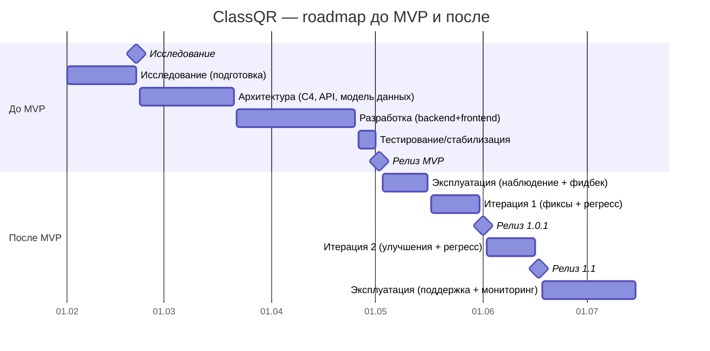

# LIFECYCLE_SYSTEM — жизненный цикл системы ClassQR

Цель документа: зафиксировать этапы жизненного цикла системы (от исследования до релиза MVP и дальнейшего развития), а также ключевые артефакты и активности на каждом этапе.

---

## 1) Таймлайн (вехи)

## 1.0 Визуализация (roadmap)

### 1.1 Исследование (до 21 февраля)
**Период**: старт проекта → **21.02**  
**Содержание работ**:
- анализ задачи, ролей (teacher/student/admin) и основных сценариев
- выбор стека и платформы деплоя
- формирование требований к MVP (без детализации в этом документе)
**Артефакты**:
- черновые заметки/обоснования решений

### 1.2 Проектирование архитектуры (до 21 марта)
**Период**: 22.02 → **21.03**  
**Содержание работ**:
- проработка архитектуры и модулей (C4 подход, разделение controller/service/repository/model)
- проектирование API контрактов
- проектирование модели данных и ключевых сущностей
**Артефакты**:
- `docs/ARCHITECTURE_PROJECT.md`
- `docs/API_EXAMPLES.md`

### 1.3 Разработка (после 21 марта → до начала релизной стабилизации)
**Период**: 22.03 → (стабилизация перед релизом)  
**Содержание работ**:
- реализация backend (Flask API), frontend (Vue SPA)
- интеграция QR сценария, проверка ответов, рейтинг, аналитика/кластеризация
- подготовка production-конфигов (Render, env, healthcheck)
**Артефакты**:
- исходный код `backend/`, `frontend/`
- `docs/DEPLOY_RENDER.md`

### 1.4 Тестирование и стабилизация (перед релизом MVP)
**Период**: стабилизационное окно перед релизом  
**Содержание работ**:
- ручное тестирование основных пользовательских сценариев
- динамическое тестирование API
- статическое тестирование (ревью конфигов/рисков)
- добавление/расширение автотестов (smoke/regression)
**Артефакты**:
- `docs/TESTING_MANUAL_STATIC.md`
- `docs/CHECKLIST_RELEASE.md`
- `docs/CHECKLIST_MOBILE_PROD.md`
- `docs/REPORT_STATIC_TESTING.md`
- `docs/REPORT_DYNAMIC_TESTING.md`
- `docs/REPORT_MANUAL_TESTING.md`
- автотесты: `backend/tests/`

### 1.5 Релиз MVP (2 мая)
**Дата релиза**: **02.05**  
**Содержание работ**:
- финальный регресс по чек-листу релиза
- проверка production окружения (Render): доступность, SPA rewrites, healthcheck
- фиксация версии/состояния (MVP)
**Артефакты**:
- актуальные `docs/*` (архитектура/деплой/тестирование/чек-листы)

### 1.6 Эксплуатация (“выход в свет”) и дальнейшая разработка
**Период**: после 02.05  
**Содержание работ**:
- сбор дефектов/обратной связи
- приоритизация и итерационная доработка
- регрессионное тестирование перед каждым обновлением
- расширение автотестов (рост покрытия)
**Артефакты**:
- новые записи в отчётах тестирования по версиям/итерациям
- обновления `docs/` по мере изменения системы

---

## 2) Полный жизненный цикл после релиза (детально)

Ниже — “как живёт система” после выхода MVP. Это цикл, который повторяется для каждой итерации.

### 2.1 Эксплуатация (Run)
**Цель**: система работает стабильно, пользователи могут выполнять ключевые сценарии.

**Что делаем**:
- мониторим доступность backend (healthcheck `GET /health`) и ошибки 4xx/5xx
- контролируем корректность настроек production: CORS, baseURL, SPA rewrite на фронте
- собираем фидбек и дефекты (UI/UX, бизнес-логика, аналитика)

**Артефакты**:
- краткие записи о проблемах и решениях (в дневнике/issue-трекере)
- результаты ручного прогона по релизному чек-листу перед плановыми обновлениями

### 2.2 Поддержка и исправления (Maintain)
**Цель**: быстро закрывать P0/P1 дефекты без “ломания” системы.

**Типовые работы**:
- bugfix в backend/frontend
- уточнение сообщений об ошибках и статусов HTTP
- стабилизация производительности (запросы к БД, N+1, тяжёлые эндпоинты)

**Контроль качества**:
- автотесты `pytest` должны проходить
- прогон `docs/CHECKLIST_RELEASE.md` (минимум — критичные пункты)

### 2.3 Развитие функционала (Change/Build)
**Цель**: добавлять фичи без деградации качества.

**Что делаем**:
- уточняем требования к фиче (user story + критерии приёмки)
- обновляем API/контракты, если нужно (с обратной совместимостью)
- расширяем документацию (архитектура, примеры API)
- расширяем автотесты под новые ветки логики (регресс)

### 2.4 Тестирование перед релизом (Test/Release readiness)
**Минимальный набор**:
- автотесты: `cd backend && python3 -m pytest -q`
- динамическое тестирование API (smoke)
- ручной прогон сценариев по `docs/CHECKLIST_RELEASE.md`
- мобильный прогон QR в production по `docs/CHECKLIST_MOBILE_PROD.md`

**Артефакты**:
- `docs/REPORT_DYNAMIC_TESTING.md` (факт прогона: pass/fail)
- `docs/REPORT_MANUAL_TESTING.md` (что проверено, что не проверено, дефекты)

### 2.5 Деплой и публикация версии (Deploy)
**Цель**: обновить production безопасно и предсказуемо.

**Что делаем**:
- деплоим backend/frontend на Render
- проверяем `/health`
- проверяем SPA rewrite и базовые страницы после обновления

### 2.6 Безопасность (Secure)
**Цель**: не допускать утечек и уязвимостей.

**Что делаем регулярно**:
- ротация секретов при необходимости (`SECRET_KEY`, `JWT_SECRET_KEY`, bootstrap token)
- проверка CORS allowlist (только домен фронта)
- проверка ролей на эндпоинтах (RBAC)

### 2.7 Завершение жизненного цикла (End-of-life, при необходимости)
**Когда актуально**: закрытие учебного проекта, смена платформы, перенос системы.

**Что делаем**:
- делаем финальный backup данных (PostgreSQL)
- фиксируем финальную версию документации
- отключаем сервисы на Render или переводим в read-only режим (если нужен архив)

---

## 3) Правила сопровождения (минимум, коротко)
- Перед каждым релизом/деплоем: прогон `docs/CHECKLIST_RELEASE.md`.
- Для мобильной проверки QR в production: прогон `docs/CHECKLIST_MOBILE_PROD.md`.
- После изменений API/архитектуры: обновление `docs/ARCHITECTURE_PROJECT.md` и `docs/API_EXAMPLES.md`.
- После каждого тестового прогона: обновление соответствующего отчёта в `docs/REPORT_*.md`.

